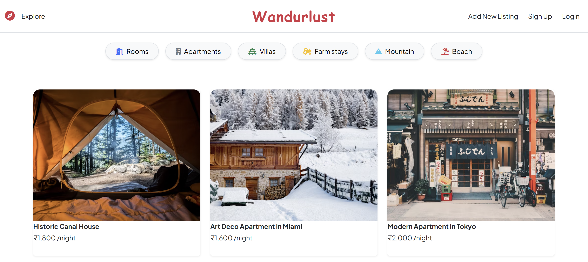
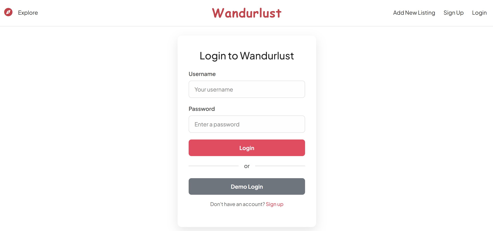
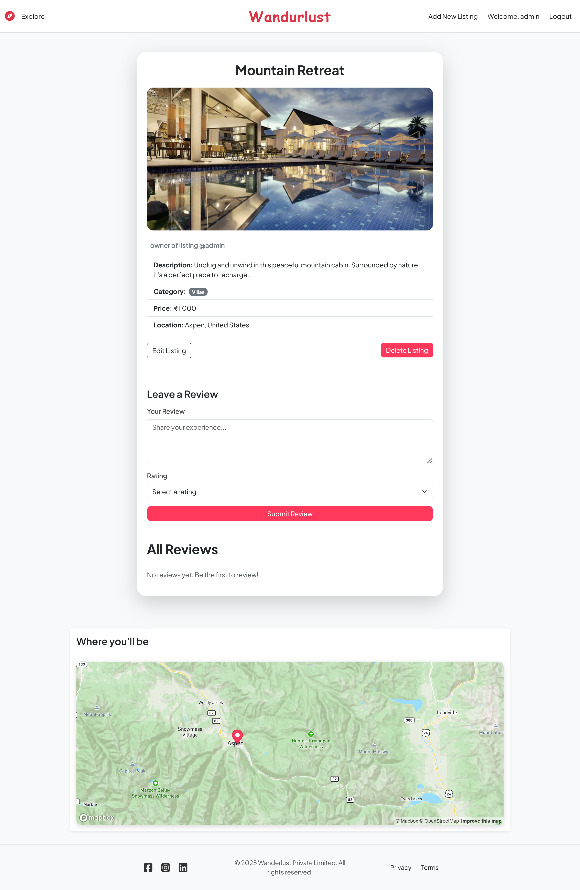

# 🏕️ Wanderlust – Property Listing Platform

A full-stack web application that allows users to list, browse, and book properties like villas, hotels, and homestays. Inspired by Airbnb, Wanderlust includes secure user authentication, location-based mapping, image uploads, and review features.

---

## 🔗 Live Demo
🌐 [wandurlust-4b7l.onrender.com](https://wandurlust-4b7l.onrender.com)

---

## 🚀 Features

- 🔐 User registration & login (with session-based auth)
- 🏠 Add, edit, delete property listings (CRUD)
- 🗺️ Map integration with Mapbox
- 🖼️ Cloud image uploads via Cloudinary
- 💬 Leave reviews and ratings for properties
- 🔒 Role-based access control for listings/reviews
- 💡 Flash messages, error handling, and alerts

---

## 🛠️ Tech Stack

**Frontend:**
- EJS templating engine
- Bootstrap 5

**Backend:**
- Node.js
- Express.js
- MongoDB (Mongoose)
- Passport.js (for authentication)
- Cloudinary (image hosting)
- Mapbox (geolocation)

---

## 📸 Screenshots

### 🏠 Homepage


### 🔐 Login Page


### 🏡 Create Listing Page


### 🗺️ Listings with Map Integration


---

## 📂 Folder Structure (Basic)

```bash
.
├── models/              # Mongoose schemas
├── routes/              # Express routes
├── views/               # EJS templates
├── public/              # Static files (CSS, JS)
├── ss/                  # Screenshots for README
├── utils/               # Custom middleware & helpers
├── app.js               # Main Express app
└── README.md


Create a .env file:

DB_URL=your_mongodb_connection_string
CLOUDINARY_CLOUD_NAME=your_cloud_name
CLOUDINARY_API_KEY=your_api_key
CLOUDINARY_API_SECRET=your_api_secret
MAPBOX_TOKEN=your_mapbox_token
SESSION_SECRET=your_session_secret